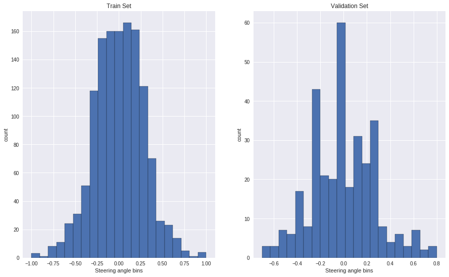

# Behavioral Cloning Project

[](http://www.udacity.com/drive)

Overview
---
This repository contains starting files for the Behavioral Cloning Project.

In this project, we will use deep neural networks and convolutional neural networks to clone driving behavior. The model we train using Keras will output a steering angle to an autonomous vehicle.

The Project
---
The goals / steps of this project are the following:
* Use the simulator to collect data of good driving behavior 
* Design, train and validate a model that predicts a steering angle from image data
* Use the model to drive the vehicle autonomously around the first track in the simulator. The vehicle should remain on the road for an entire loop around the track.
* Summarize the results with a written report

Administrative Stuff
---
Below are the files as required in the rubric
1. [drive.py](https://github.com/vikramriyer/Teach_A_Car_To_Drive_Using_Deep_Learning/blob/master/drive.py)
2. [model.py](https://github.com/vikramriyer/Teach_A_Car_To_Drive_Using_Deep_Learning/blob/master/model.py)
3. [model.h5](https://github.com/vikramriyer/Teach_A_Car_To_Drive_Using_Deep_Learning/blob/master/model.h5) <br>
Not viewable. Please download to run the simulator.
4. [video](https://github.com/vikramriyer/Teach_A_Car_To_Drive_Using_Deep_Learning/blob/master/run1.mp4) of the car driving itself. <br>
Not viewable. Please download to view. OR [YoutubeLink](https://youtu.be/DC2Br_Sq0P4) to view (driver's view) directly. <br>
__PS: The video quality is not the greatest but I am submitting the project anyways. Will update if I create a better one after data augmentation.__
5. README <br>
This is the github readme.

## Steps

### Dataset summary
We have 2 types of files to look at in this dataset
1. __The driving_log.csv__ <br>
This file has information about the paths where the images (left, center, right) are stored on the disk, the steering angle, throttle, reverse, speed. <br>
For this project, we will only be focussing on steering angle and pose this problem as a regression problem. Our speed will be kept constant at 9kmh, however, at each frame, the steering angle will be predicted and the car will steer itself appropriately.
2. __IMG dir__ <br>
This directory consists images taken using the left, center and right cameras mounted on the car. For this version of the project, I used only the center images and could train a model to successfully steer it on road for 1 lap. <br>
For the next versions, when I work on the challenge problems, I might use the left and right images to make the model robust.

After the thresholding we have,

|  Total | Train  | Valid |
|----------|-----------|-----------|
|1642|1313|329|

### Dataset exploration

Let's check how our data was distributed before the thresholding and what is the final statistic of the dataset.

__Before Thresholding__


__After Thresholding__


__Statistics of Train and Validation set__



#### What is the thresholding step anyways?
Since we have a lot of images having 0 as the steering angle, we wanted to avoid any bias and there was no use training the algo on similar set of images with the prediction variable being same. So, we set __200__ to be a threashold and only that many images having steering angle 0 were picked __randomly__. 

```python
bin_threshold = 200
remove_ixs = []
for i in range(total_bins):
  temp_list = []
  for j in range(df.steering.size):
    if df['steering'][j] >= bins[i] and df['steering'][j] <= bins[i+1]:
      temp_list.append(j)
  # ensure that data is dropped randomly rather than a specific portion of the recording
  temp_list = shuffle(temp_list)
  temp_list = temp_list[bin_threshold:]
  remove_ixs.extend(temp_list)
df.drop(df.index[remove_ixs], inplace=True)
```

### Preprocessing Data
The preprocessing steps we are going to follow are listed below <br>

#### Color space selection
We will be using the model proposed by NVidia that uses the left, center and right images for the bahavioural cloning project.
Convert to __YUV__ space
```python
img = cv2.cvtColor(cv2.imread(img_path), cv2.COLOR_BGR2YUV)
```

#### Region of Interest
We can see that the scenery is actually a distraction for the model and we are better off focusing only on the road track. So, we will be slicing the part that is required and ommiting the upper half of the image.
```python
img = img[60:135,:,:]
```

#### Smoothing the image with a gaussian filter
This is usually a common step in the image preprocessing where our intent is to denoise the image of any form of clutter. As we are replicating the Nvidia model, we will use this step as mentioned in the model preprocessing stage.
```python
img = cv2.GaussianBlur(img, (3, 3), 0)
```

#### Reshape to fit the input size of Nvidia Model (200x66x3)
To avoid any form of bias as well as having to manage images differently depending only on its size is usually avoided by reshaping the input images to the same size. We can call it a standardizing step that helps us avoid unwanted computation. 
```python
img = cv2.resize(img, (200, 66))
```

#### Image Normalization
Normalization or min-max scaling is a technique by which the values in the image are scaled to a fixed range. In our case we will fit them between 0-1. Typically in a neural network architecture, convergence is faster if the data points follow a similar distribution. The variance in the data is also reduced by using normalization after the zero-centering. This makes the computations faster as well, thus helping in faster convergence.
```python
img = img/255
```

### Model Architecture and Training

Below is the architecture of the Model, a modified version as inspired from LeNet.

|  Layer  | Output_Shape | Total_Parameters |
|----------|-----------|-----------
||||
||||
||||
||||

The activation functions:

|  Activation  | Comments |
|----------|-----------|
| RELU | Used at the conv layers |
| SOFTMAX | Used at the last to get the probabilities of the classes |

Let's find out in short what each of the layers do: <br>
**Conv layer** <br>
We (rather the library) use a kernel or a filter that is a matrix of values and we do simple matrix multiplication and get values that are passed on as inputs to the next layers. This operation finds out certain details about the image like edges, vertices, circles, faces, etc. These kernels are chosen at random by the library and each of these produce some form of results about the features. These kernels are

**Max Pool** <br>
We simply reduce the dimentionality of the images. This methods uses the knowledge about the fact that the adjacent pixels have almost the similar contribution in terms of view of an image and hence can be removed. There are 2 famous types of pooling methods, namely, max-pooling and average pooling. In our architecture, we use the max-pooling where from a 2x2 matrix, the max value is used to construct a mapping with single pixel value.

**Fully connected layer** <br>
The convolutional layers learn some low level features and to make most of the non-linearities, we use the FC layers that perform combinations of these features and find the best of these to use. This process is again done by using back propogation which learns the best of combinations.

**Dropout** <br>
We randomly drop some information from the network. Though there is a experimental proof about this working well, we can in short say that this method reduces over fitting. It is a form of Regularization.

#### Training
Finally that our architecture is decided, we use the __Adam optimizer__ for training the model. We would not go into details of how the Adam optimizer works but in short we can say that, "**An optimizer in general minimizes the loss in the network.**"

The hyperparameters: 

|  Name  | Value |
|----------|-----------|
| EPOCHS |  |
| LEARNING RATE |  |
| BATCH SIZE |  |

## Discussion
---

### Potential Shortcomings in the Project 

### Possible Improvements
